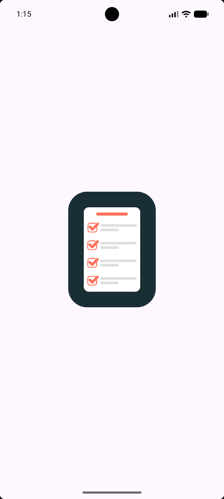
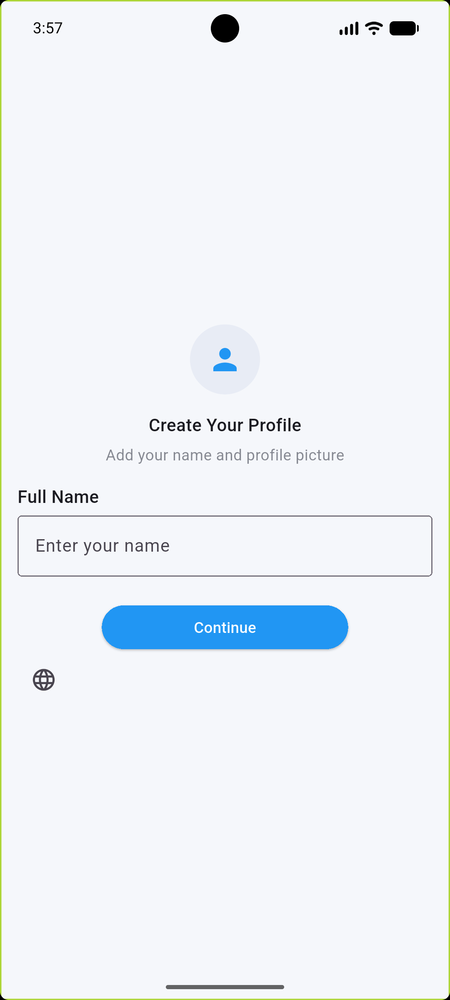
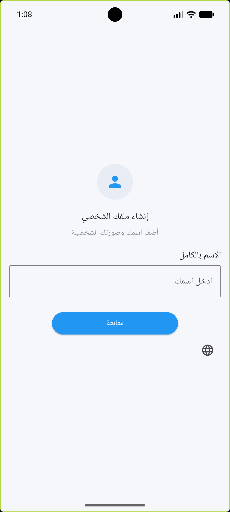
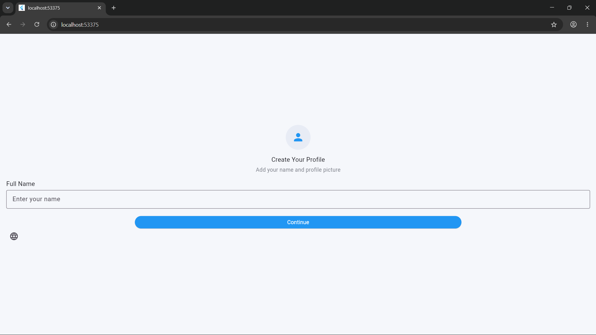
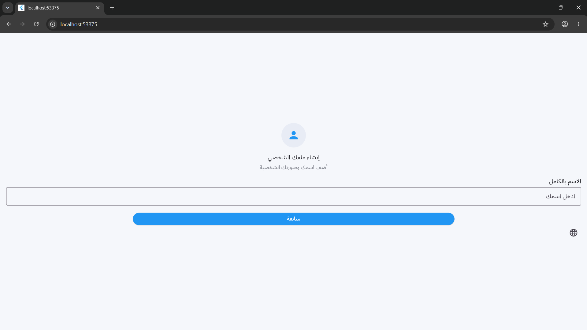
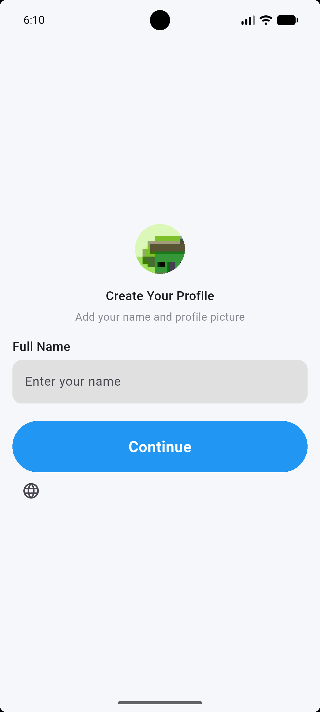
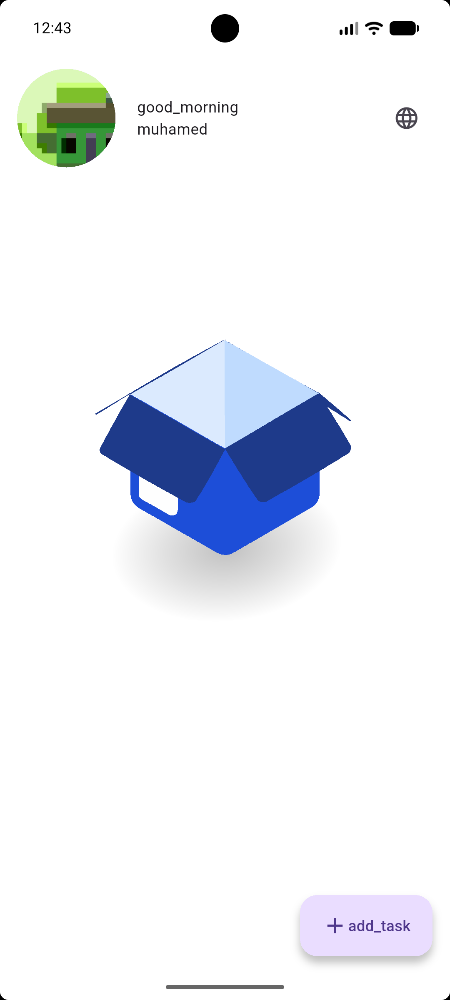
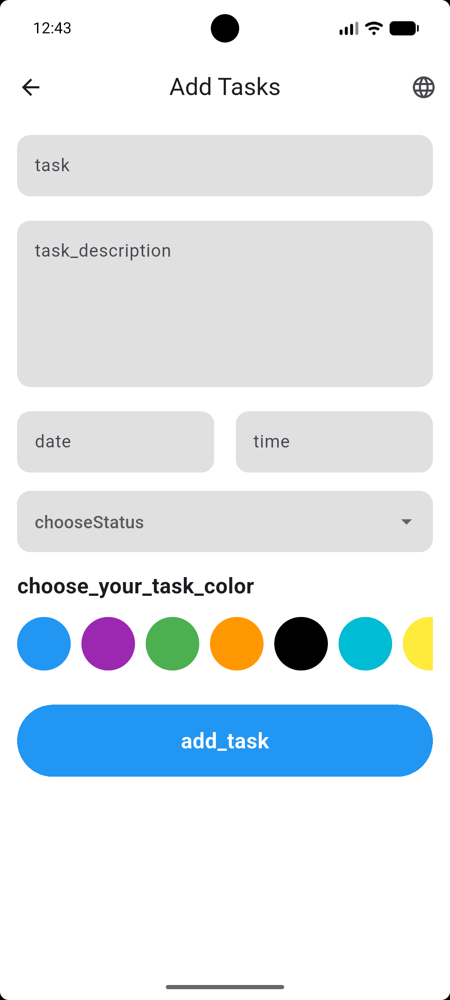

# To_Do_APP











```
flutter pub run build_runner build --delete-conflicting-outputs
dart run easy_localization:generate -S assets/translations -O lib/gen -o locale_keys.g.dart -f keys
```